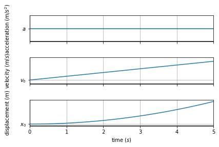

`2017-09-18 Monday`
# Mechanics
- Displacement ($m$): $x$ (initial displacement: $x_0$)
- Velocity ($m/s$): $v$ (initial velocity: $v_0$)
- Acceleration ($m/s^2$): $a$ 

## Graphs of motion
For constant acceleration with $v_0$ and $x_0$


```python
%matplotlib inline
import matplotlib.pyplot as plt
import numpy as np

t = np.linspace(0, 5)
a = t * 0 + 1
v = 1 + a * t
s = 1 + (v - 1) * t / 2

_, (a1, a2, a3) = plt.subplots(3, sharex=True)
for ax, y, y0_name, description in zip(
    (a1, a2, a3), 
    (a, v, s), 
    ('$a$', '$v_0$', '$x_0$'), 
    ('acceleration ($m/s^2$)', 'velocity ($m/s$)', 'displacement ($m$)')
):
    ax.plot(t, y)
    ax.grid(True, which='both')
    plt.xlabel('time ($s$)')
    ax.set_ylabel(description)
    plt.xticks(range(10))
    plt.xlim([0, 5])
    ax.set_ylim([0, max(y) + 1])
    ax.set_yticks([1])
    ax.set_yticklabels([y0_name])
    ax.axhline(y=0, color='k')
    ax.axvline(x=0, color='k')
    ax.get_yaxis().set_label_coords(-0.1,0.5)
plt.tight_layout()

```

- $v = \frac{\Delta x}{\Delta t}$ (change in displacement over time)
- $a = \frac{\Delta{v}}{\Delta{t}}$ (change in velocity over time)

## Equation of motion for constant acceleration
$v = v_0 + at$  
$x = v_0 t - \frac{1}{2} a t^2 + x_0$  
$v^2 = {v_0}^2 + 2 a x$  
${v_y}^2 = v_{0y}^2 + 2 a y$

## Exercise
### 1.
What will the max height for the cannonball? given:
$v = 25m/s$
$\alpha = 25º$

at maximum height $v_y = 0$, so $0 = {v_{0y}}^2 + 2ay \Leftrightarrow y = \frac{-{v_{0y}}^2}{2a}$  
$y = \frac{-v\sin(\theta)^2}{2a} = 5.6m$

### 2.
Firefighter aiming hose at 78.5º.  
Water leaving hose at 32m/s.  
What height can the water reach?

$y = \frac{-(32 \sin(78.5º)^2}{-20} = 49m$

## Air resistance
Weight of object and force of air resistance are equal to each other at terminal velocity.

Air resistance / Drag, $\text{AirR}$

- $\propto v^2$
- $\propto$ surface Area
- $\propto \rho$  (density of fluid)
- $\propto$ drag coefficient

# Balanced forces
Focus are in equilibrium $\Rightarrow \vec{F_1} + \vec{F_2} + \vec{w} = \vec{0}$

    F1      F2
    -       -
    |\ θ|θ /|
      \-|-/
       \|/
        |
        |
        |
       \ /
        w
       
- $F_{1x} = F_1 \cos \theta$
- $F_{1y} = F_1 \sin \theta$
- $F_{1x} = F_2 \cos \theta$
- $F_{1y} = F_2 \sin \theta$
- $w_x = 0$
- $w_y = w$

$\vec{F_1} + \vec{F_2} + \vec{w} = 0$  
$\vec{F_1} \sin \theta + \vec{F_2} \sin \theta = -w$  
$\vec{F_{1y}} + \vec{F_{2y}} = - \vec{w}$

# Power, work, energy in mechanical systems
## Energy 
Energy is the potential to do work, measured in Joules.

### Kinetic energy
Kinetic energy is relative to motion:  
$$E_k = \frac{1}{2} m v^2$$

### Gravitational potential energy
The energy related to a gravitational field.  
$$E_p = m g h$$

- `m`: mass
- `g`: gravitational acceleration
- `h`: height

In a closed system with no heat losses, mechanical energy is conserved:  
$$E_p + E_k = \text{constant}$$

Energy is **always** conserved.

## Work
Work is the energy being transferred from one thing to another.

In mechanics, this transferrence is via a force.

$$W = F d$$

- `W`: $[J] = \frac{[kg] \times [m]^2}{[s]^2}$
- `F = m a`: $[N] = \frac{[kg] \times [m]}{[s]^2}$
- `d`(displacement) = $[m]$

Note: force and displacement should in the same direction ($W = cos \theta F s$)
